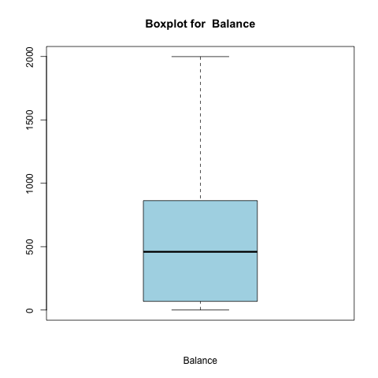
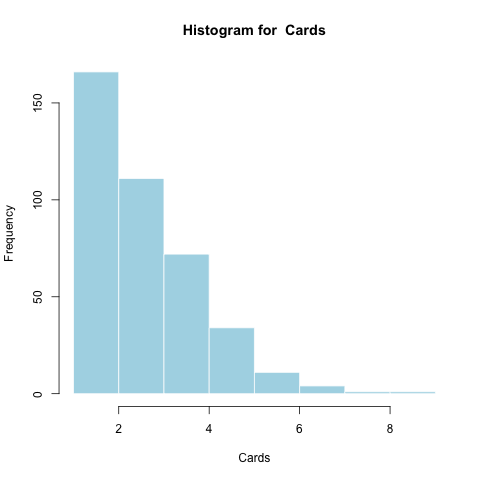
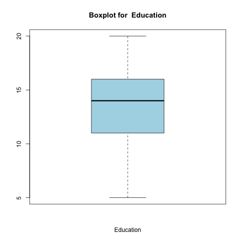
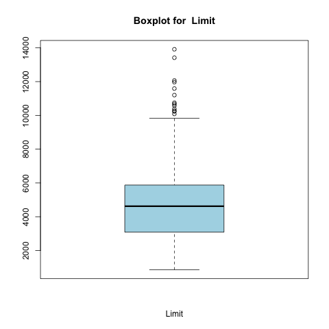
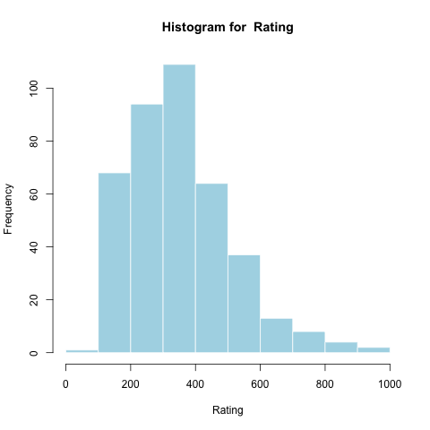
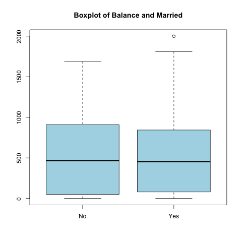

# Abstract

In this report, we examine the variables in the Credit.csv dataset from _An Introduction to Statistical Learning_ by Gareth James, Daniela Witten, Trevor Hastie and Robert Tibshirani. We evaluate five different regression models using a validation set from the original data. We evaluate ordinary least squares against regularization methods Lasso and Ridge Regression, and dimension reduction methods Principal Components Regression and Partial Least Squares Regression. We ultimately find that all five methods produce similar test mses, with Ridge Regression narrowly producing the best result.

# Introduction

The purpose of this report is to determine the best model for predicting Balance given ten different predictors, including quantitative variables such as income and qualitative variables such as ethnicity. The distributions of these variables will be examined through summaries and plots, and five different regression models will be applied to the data; ordinary least squares, ridge, lasso, principal components, and partial least squares. These five models will be compared by looking at their respective coefficients and also by comparing their mean squared errors. 

```{r, echo = FALSE}
library(pander)
panderOptions('digits', 4)
```
# Data

The Credit.csv dataset has the balance (or the average credit card debt) for individuals with a number of quantitative descriptors including age, cards (the number of credit cards), education (the number of years of education), income (thousands of dollars), limit (their credit limit), and rating (their credit rating), as well as qualitative descriptors such as gender, student (whether or not they're a student), married (whether or not they're married), and ethnicity. 

Our target variable is `Balance`. We get a sense of how it's distributed with a boxplot and histogram.

```{r, out.width = "200px", echo=FALSE}
knitr::include_graphics("../images/Histogram_Balance.png")

```

```{r, echo=FALSE}
balance <- read.csv("../data/summaries/Summary_Balance.csv", header = TRUE, row.names = 1, sep=",")
pander(balance)
```

*The average balance falls at about \$500,000, with a long tail. This is not a classical distribution - a huge portion of accounts have balances below \$200,000, but this is not surprising from a common sense perspective.*

Now we look at our predictors, with an initial visual exploration of the quantitative variables. 

### Age

```{r, out.width = "200px", echo=FALSE}
knitr::include_graphics("../images/Histogram_Age.png")
knitr::include_graphics("../images/Boxplot_Age.png")
```

```{r, echo=FALSE}
age <- read.csv("../data/summaries/Summary_Age.csv", header = TRUE, row.names = 1, sep=",")
pander(age)
```

*Account holders are on average in their fiftes, with a generous spread. Ages are fairly normally distributed.*

### Credit Cards

```{r, out.width = "200px", echo=FALSE}

knitr::include_graphics("../images/Boxplot_Cards.png")
```

```{r, echo=FALSE}
cards <- read.csv("../data/summaries/Summary_Cards.csv", header = TRUE, row.names = 1, sep=",")
pander(cards)
```

*The average account holder has around 3 cards, but cards look more exponentially distributed - many people have only one or two.*

### Years of Education

```{r, out.width = "200px", echo=FALSE}
knitr::include_graphics("../images/Histogram_Education.png")

```

```{r, echo=FALSE}
education <- read.csv("../data/summaries/Summary_Education.csv", header = TRUE, row.names = 1, sep=",")
pander(education)
```

*The interquartile range of education falls between 11 and 16 years - highschool and college. Years of education is fairly normal with a bit of a left skew.*

### Income

```{r, out.width = "200px", echo=FALSE}
knitr::include_graphics("../images/Histogram_Income.png")
knitr::include_graphics("../images/Boxplot_Income.png")
```

```{r, echo=FALSE}
income <- read.csv("../data/summaries/Summary_Income.csv", header = TRUE, row.names = 1, sep=",")
pander(income)
```

*Incomes skew heavily right in this data set - there is a large difference between the mean income, \$45,00, and the median, \$30,000*

### Credit Limit

```{r, out.width = "200px", echo=FALSE}
knitr::include_graphics("../images/Histogram_Limit.png")

```

```{r, echo=FALSE}
limit <- read.csv("../data/summaries/Summary_Limit.csv", header = TRUE, row.names = 1, sep=",")
pander(limit)
```

*The average credit limit is around \$5000, with a long tail. Credit limits are somewhat normal with a right skew.*

### Credit Rating

```{r, out.width = "200px", echo=FALSE}

knitr::include_graphics("../images/Boxplot_Rating.png")
```

```{r, echo=FALSE}
rating <- read.csv("../data/summaries/Summary_Rating.csv", header = TRUE, row.names = 1, sep=",")
pander(rating)
```

*Ratings are a bit less than 400, on average. Rating is distributed similarly to Credit Limit- probably because Credit ratings are used to determine credit limits.*

### Correlations

We look at the correlation matrix of the quantitative variables to get a visual sense of how they are related.


```{r=FALSE, echo=FALSE}
load("../data/eda.Rdata")
pander(cor(quant_data))
```
Most variables look positively correlated with `Balance`. `Income`, `Limit`, and `Rating` all seem to have particularly high correlations and less noise. However, they look closely correlated with each other, which can be a problem for linear modeling. Fortunately, our dimension reduction techniques can ameliorate some of those issues- we may hypothesize that they will do particularly well on this data.

*****

Now we consider qualitative variables, with histograms and conditional boxplots (we look at the values of `Balance` grouped by the variable in question).

### Gender

```{r, out.width = "200px", echo=FALSE}
knitr::include_graphics("../images/Barplot_Gender.png")
knitr::include_graphics("../images/Conditional_Boxplot_Balance_Gender.png")
```

```{r, echo=FALSE}
gender <- read.csv("../data/summaries/Freq_Summary_Gender.csv", header = TRUE, row.names = 1, sep=",")
colnames(gender) <-c("Gender", "Frequency")
pander(gender)
```

*Accounts are split fairly evenly, with a few more held by women. Average account balance is about the same, but the spreads are slightly different between genders.*

### Ethnicity

```{r, out.width = "200px", echo=FALSE}

knitr::include_graphics("../images/Conditional_Boxplot_Balance_Ethnicity.png")
```

```{r, echo=FALSE}
ethnicity <- read.csv("../data/summaries/Freq_Summary_Ethnicity.csv", header = TRUE, row.names = 1, sep=",")
colnames(ethnicity) <-c("Ethnicity", "Frequency")
pander(ethnicity)
```

*Account holders are about a quarter African American, a quarter Asian, and half Caucasian. Average account balance is about the same across ethnicities, with Asian accounts being distributed a bit more widely.*

### Student

```{r, out.width = "200px", echo=FALSE}


```

```{r, echo=FALSE}
student <- read.csv("../data/summaries/Freq_Summary_Student.csv", header = TRUE, row.names = 1, sep=",")
colnames(student) <-c("Student", "Frequency")
pander(student)
```

*Most account holders are not students. Students generally seem to have much higher balances - surprising considering that they rarely have significant income.*

### Married

```{r, out.width = "200px", echo=FALSE}
knitr::include_graphics("../images/Barplot_Married.png")

```

```{r, echo=FALSE}
married <- read.csv("../data/summaries/Freq_Summary_Married.csv", header = TRUE, row.names = 1, sep=",")
colnames(married) <-c("Married", "Frequency")
pander(married)
```

*A majority of account holders are married, but there are plenty of nonmarried account holders. Balances seem to be similarly distributed for married and nonmarried accounts.*

### Anova on Categorical Variables

```{r, echo=FALSE}
pander(summary(aov_qualitative))
```

*Only `Student` produces a significant F-statistic. The other categorical variables do not have a strong relationship with Balance.*

*****

Overall, we get the sense that `Income`, `Rating`, `Limit`, and `Student` will be particularly useful predictors for `Balance`.

### Data Processing
Since we are building regression models in this project, we need to convert all of our categorical variables to quantitative ones. We do this by creating new binary variables, or dummy variables. 
Additionally, we need to mean-center and standardize all the variables so that they all have comparable scales, as dimension reduction methods can be greatly thrown off by predictors with wildly different scales.

# Methods

In this project, we attempt to create an accurate predictive model for `Balance` given our predictors using regression methods. We will evaluate 5 methods: ordinary least squares on the data to serve as our benchmark regression model. In addition, we will also perform two shrinkage methods - ridge regression and lasso regression -  and two dimension reduction methods - principal components regression and partial least squares regression. These last four methods are all variations on least squares regression which attempt to mitigate particular weaknesses of ordinary least squares.

Generally, predictive models wrestle with what is known as the *bias-variance tradeoff*. When we fit a model to data, we want the model to be as close as possible to the actual underlying distribution. For a linear model, we use the assmuption of linearly related variables and a normally distributed error term centered at zero. Under this model, we can show that least squares estimates of our variable coefficients are *unbiased*: that given infinite samples, we will find the true coefficient. But in reality, we rarely have unlimited samples, and a result of this is that ordinary least squares regression has high *variance*: estimates vary quite a bit based on the training data. The result is *overfitting*, when the model is too specific to the training data, and fails to provide accurate predictions when given new data.

### Regularization
Regularization methods attempt to reduce variance by "shrinking" coefficients towards zero, which they do by adding a function of the coefficients to the sum or squared residuals typically minimized in least squares regression. The difference between lasso and ridge regression is simply the function - lasso uses the l1 norm (the sum of the absolute value of the coefficients), while ridge regression uses the l2 norm (the sum of the square of the coefficients). The result of this difference is that lasso often sets coefficients to zero and thus functions as a method of subset selection on the predictors, for reasons beyond the scope of this paper. From our original data exploration, we saw that many of the predictors had weak relationships with `Balance`, and are likely to not provide any valuable information for our prediction. Eliminating them from the model by setting their coefficients to zero may decrease our risk of overfitting, so we may hypothesize that lasso will perform particularly well.

### Dimension Reduction 
Dimesion reduction models take an alternative approach: rather than fitting a model with the original predictors, we create new predictors from linear combinations of the original predictors. Typically, we end up fitting a model with fewer variables than we had originally, which reduces the dimension of the predictor space. This is valuable because in high-dimensional spaces, "distance" as measured by residuals becomes larger and less useful. Another benefit is that when multiple predictors have a strong relationship with each other, we can combine them into a single variable, and reduce the problems created by multicollinearity. As we saw, many of our quantitative variables were highly correlated, so these methods are particularly valuable. The two methods we use are Principal Components and Partial Least Squares, which use similar methods to create these linear combinations of original predictors. Neither clearly dominates the other, so we will evaluate both.


### Model Validation
Our ultimate goal is to build an accurate predictive model, so it is critical that we choose the model which will produce the lowest error on new data. To estimate our error statistic, mean squared error, on the different models, we will reserve a portion of our data as a validation set. We will train our models on the majority of the data, and then calculate mse on the data which was not used to fit the data. This will help us select the model with the lowest bias (closest to the true distribution) that is not overfit on the training data.

# Analysis

```{r include=FALSE}
library(pander)
library(ggplot2)
load("../data/results.Rdata")
```

### Ordinary Least Squares

For the ordinary least squares regression model, we used the `lm()` function to fit an additive model with all predictors on the training data. We estimated the test mse on the validation set for comparison to the other models, then refit the model on the full data set

### Lasso and Ridge Regression
For the shrinkage methods, we used the package `glmnet`. As mentioned in the Methods section,  these methods work by adding either the l1 or l2 norm of the coefficients to the residuals being minimized. The specific function is controlled by a tuning parameter, $\Lambda$. A higher $\Lambda$ produces smaller coefficients. In order to select the coeffient that strikes the best balance between bias and variance, we perform 10-fold cross validation with the function `cv.glmnet()`. We tried a wide variety of lambda values, and both ridge regression and lasso selected the smallest value, 0.01, as the best.

```{r, out.width = "200px", echo=FALSE}


```

*We can see that both methods get the smallest cross-validated MSE at small values of $\Lambda$*

Using this value of lambda, we tried our best model on the test data set to find the test mse by using the function `predict()`, and finding the mean of the squared differences between the predicted outputs and the actual test outputs. We also called the `glmnet()` function to fit the model on the full data set, and used `predict()` again to find the official model coefficients. 


### Principal Components Analysis and Partial Least Squares
For the dimension reduction methods, we used the package `pls`. The functions `pcr()` and `plsr()` were used depending on which regression model we were fitting, with the argument `validation = "CV"` to perform 10-fold cross-validation. In these methods, model selection is based on how many *components* are included in the final model, where each component is a linear combination of the original predictors. We call $validation$PRESS on the output of this function and then find the number of components that yields the lowest mse. For PCR, we selected the full model, but for PLSR, we actually fit a model with only 6 components.

```{r, out.width = "200px", echo=FALSE}

knitr::include_graphics("../images/plsr_validationplot.png")
```

*Interestingly, PLSR flattens out much more quickly than PCR.*

As with the other models, we estimate the test mse by using the `predict()` function, and refit the model using the full data set with the functions `pcr()` or `plsr()` to find the official model coefficients. 

---
output: pdf_document
---

# Results

```{r include=FALSE}
library(pander)
library(ggplot2)
load("../data/results.Rdata")
```


```{r, echo=FALSE, out.width=1000}
panderOptions('round', 5)
panderOptions('keep.trailing.zeros', TRUE)
pander(coeff_table, caption="Coefficients for Different Models")
```

As we can see in Table 1, which has the official coefficients from the Credit dataset for each of the models (Ordinary Least Squares, Ridge, Lasso, Principal Components Regression, and Partial Least Squares Regression), most of the coefficient estimates are similar across the different models but the lasso model produces coefficient estimates of zero for four of the predictors, as predicted in the Methods section. 

 \begin{center}Figure 1: Coefficients Plot\end{center}

Looking at a plot of these coefficients separated by model, we can more easily see for which predictors the estimated coefficients differ. The estimates for most of the predictors are very similar across the models, but for limit and rating, the estimated coefficients differ quite significantly. As we discussed in the Data section, these variables are highly correlated, because credit limits are often determined by credit ratings - their correlation matrix showed a nearly perfect linear relationship. Variation in coefficient estimation is a common result of having collinear predictors.

 \begin{center}Figure 2: Coefficients Plot (separated by model)\end{center}


Another plot of these coefficients is given in Figure 2, which has separate plots for each of the models. 

```{r, echo=FALSE, warning=FALSE, out.width=1000}
pander(mse_table, caption="MSE for Different Models")
```

Now looking at Table 4, we can see the mean squared errors for our models applied to the test data, and that the lowest mean squared error for the regression alternatives (not the ordinary least squares model) is for the ridge regression model, with a value of `r I(mse_table[2])`. However, the test mses are all extremely close together, and it's hard to say whether this model is truly significantly better than the other. The ordinary least squares model actually performed fairly well with an mse of `r I(mse_table[1])`, and we can see that the plsr model produced almost the exact same outcome in both mse and coefficients. 


# Conclusions

In this project, we have built five different regression models to predict Balance based on ten predictors from the dataset Credit.csv. Based on our results, we found that ridge regression produced the lowest mean squared error when applied to the test data set. However, we found that the mses were very closely clustered between the five models, and it's difficult to say whether ridge regression is truly optimal for this problem. This result is somewhat surprising: because the data had highly collinear predictors and many uncorrelated predictors, we predicted that a dimension reduction technique would be more useful, or that lasso would outperform ridge regression by eliminating some of the variables from the model. Ultimately, this was not the case.
