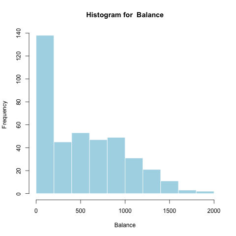
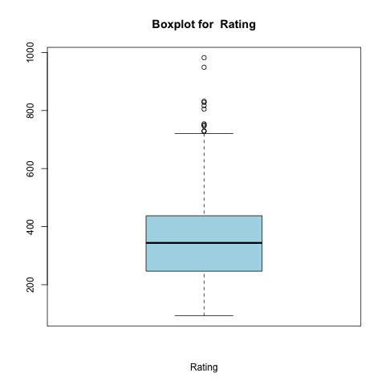

# Abstract

In this report, we will be examining the variables in the Credit.csv dataset from _An Introduction to Statistical Learning_ by Gareth James, Daniela Witten, Trevor Hastie and Robert Tibshirani. We will also be building different regression models in order to determine how to best predict Balance given ten predictors, using similar approaches as in Chapter 6. 

# Introduction

The purpose of this report is to determine the best model for predicting Balance given ten different predictors, including quantitative variables such as income and qualitative variables such as ethnicity. The distributions of these variables will be examined through summaries and plots, and five different regression models will be applied to the data; ordinary least squares, ridge, lasso, principal components, and partial least squares. These five models will be compared by looking at their respective coefficients and also by comparing their mean squared errors. 

```{r, echo = FALSE}
library(pander)
panderOptions('digits', 4)
```
# Data

The Credit.csv dataset has the balance (or the average credit card debt) for individuals with a number of quantitative descriptors including age, cards (the number of credit cards), education (the number of years of education), income (thousands of dollars), limit (their credit limit), and rating (their credit rating), as well as qualitative descriptors such as gender, student (whether or not they're a student), married (whether or not they're married), and ethnicity. 

Our target variable is `Balance`. We get a sense of how it's distributed with a boxplot and histogram.

```{r, out.width = "200px", echo=FALSE}

knitr::include_graphics("../images/Boxplot_Balance.png")
```

```{r, echo=FALSE}
balance <- read.csv("../data/summaries/Summary_Balance.csv", header = TRUE, row.names = 1, sep=",")
pander(balance)
```

*The average balance falls at about \$500,000, with a long tail.A fairly unusual distribution - a huge portion of accounts have balances below \$200,000.*

Now we look at our predictors, with an initial visual exploration of the quantitative variables. 

### Age

```{r, out.width = "200px", echo=FALSE}


```

```{r, echo=FALSE}
age <- read.csv("../data/summaries/Summary_Age.csv", header = TRUE, row.names = 1, sep=",")
pander(age)
```

*Account holders are on average in their fiftes, with a generous spread. Ages are fairly normally distributed.*

### Credit Cards

```{r, out.width = "200px", echo=FALSE}
knitr::include_graphics("../images/Histogram_Cards.png")
knitr::include_graphics("../images/Boxplot_Cards.png")
```

```{r, echo=FALSE}
cards <- read.csv("../data/summaries/Summary_Cards.csv", header = TRUE, row.names = 1, sep=",")
pander(cards)
```

*The average account holder has around 3 cards. Cards look more exponentially distributed.*

### Years of Education

```{r, out.width = "200px", echo=FALSE}

knitr::include_graphics("../images/Boxplot_Education.png")
```

```{r, echo=FALSE}
education <- read.csv("../data/summaries/Summary_Education.csv", header = TRUE, row.names = 1, sep=",")
pander(education)
```

*The interquartile range of education falls between 11 and 16 years - highschool and college. Years of education is fairly normal with a bit of a left skew.*

### Income

```{r, out.width = "200px", echo=FALSE}
knitr::include_graphics("../images/Histogram_Income.png")
knitr::include_graphics("../images/Boxplot_Income.png")
```

```{r, echo=FALSE}
income <- read.csv("../data/summaries/Summary_Income.csv", header = TRUE, row.names = 1, sep=",")
pander(income)
```

*The mean seems to be around \$30,000 a year. Incomes skew right in this data set.*

### Credit Limit

```{r, out.width = "200px", echo=FALSE}

knitr::include_graphics("../images/Boxplot_Limit.png")
```

```{r, echo=FALSE}
limit <- read.csv("../data/summaries/Summary_Limit.csv", header = TRUE, row.names = 1, sep=",")
pander(limit)
```

*The average credit limit is around \$5000, with a long tail. Credit limits are distributed normal with a right skew.*

### Credit Rating

```{r, out.width = "200px", echo=FALSE}
knitr::include_graphics("../images/Histogram_Rating.png")

```

```{r, echo=FALSE}
rating <- read.csv("../data/summaries/Summary_Rating.csv", header = TRUE, row.names = 1, sep=",")
pander(rating)
```

*Ratings are a bit less than 400, on average. Rating is distributed similarly to Credit Limit- probably because Credit ratings are used to determine credit limits.*

### Correlations

We look at the correlation matrix of the quantitative variables to get a visual sense of how they are related.


```{r=FALSE}
load("../data/eda.Rdata")
pander(cor(quant_data))
```
Most variables look positively correlated with `Balance`. `Income`, `Limit`, and `Rating` all seem to have particularly high correlations and less noise. However, they look closely correlated with each other, which can be a problem for linear modeling. Fortunately, our dimension reduction techniques can ameliorate some of those issues- we may hypothesize that they will do particularly well on this data.

*****

Now we consider qualitative variables, with histograms and conditional boxplots (we look at the values of `Balance` grouped by the variable in question).

### Gender

```{r, out.width = "200px", echo=FALSE}


```

```{r, echo=FALSE}
gender <- read.csv("../data/summaries/Freq_Summary_Gender.csv", header = TRUE, row.names = 1, sep=",")
colnames(gender) <-c("Gender", "Frequency")
pander(gender)
```

*Accounts are split fairly evenly, with a few more held by women. Average account balance is about the same, but the spreads are slightly different between genders.*

### Ethnicity

```{r, out.width = "200px", echo=FALSE}
knitr::include_graphics("../images/Barplot_Ethnicity.png")
knitr::include_graphics("../images/Conditional_Boxplot_Balance_Ethnicity.png")
```

```{r, echo=FALSE}
ethnicity <- read.csv("../data/summaries/Freq_Summary_Ethnicity.csv", header = TRUE, row.names = 1, sep=",")
colnames(ethnicity) <-c("Ethnicity", "Frequency")
pander(ethnicity)
```

*Account holders are about a quarter African American, a quarter Asian, and half Caucasian. Average account balance is about the same across ethnicities, with Asian accounts being distributed a bit more widely.*

### Student

```{r, out.width = "200px", echo=FALSE}
knitr::include_graphics("../images/Barplot_Student.png")
knitr::include_graphics("../images/Conditional_Boxplot_Balance_Student.png")
```

```{r, echo=FALSE}
student <- read.csv("../data/summaries/Freq_Summary_Student.csv", header = TRUE, row.names = 1, sep=",")
colnames(ethnicity) <-c("Student", "Frequency")
pander(student)
```

*Most account holders are not students. Students generally seem to have much higher balances - surprising considering that they rarely have significant income.*

### Married

```{r, out.width = "200px", echo=FALSE}

knitr::include_graphics("../images/Conditional_Boxplot_Balance_Married.png")
```

```{r, echo=FALSE}
married <- read.csv("../data/summaries/Freq_Summary_Married.csv", header = TRUE, row.names = 1, sep=",")
colnames(married) <-c("Married", "Frequency")
pander(married)
```

*A majority of account holders are married, but there are plenty of nonmarried account holders. Balances seem to be similarly distributed for married and nonmarried accounts.*

### Anova on Categorical Variables

```{r, echo=FALSE}
pander(summary(aov_qualitative))
```

*****

Overall, we get the sense that `Income`, `Rating`, `Limit`, and `Student` will be particularly useful predictors for `Balance`.

# Methods

For each of the quantitative variables in the Credit.csv dataset, we will look at a summary of their distributions, which includes maximum, minimum, range, median, 1st and 3rd quartiles, IQR, mean, and standard deviation, as well as histograms and boxplots.

For the qualitative variables, we will create both frequency and relative frequency tables, as well as barcharts of these tables. 

To look at the association between balance and each of the variables, we will also create a matrix of correlations for all the quantitative variables, perform ANOVA tests between balance and all the qualitative variables, and also create conditional boxplots between balance and the qualitative variables. 

Before fitting regression models, we will dummy out the categorical variables, and then mean-center and standardize all the variables so that they all have comparable scales. We will also take a random sample of size 300 from the Credit.csv dataset to be our training set, and the remaining 100 observations will serve as our test set. 

We will perform ordinary least squares on the data to serve as our benchmark regression model. In addition, we will also perform two shrinkage methods - ridge regression and lasso regression -  and two dimension reduction methods - principal components regression and partial least squares regression. 

Finally we will compare the mean squared errors (mse) that result from using each of these regression models to determine the model that results in the lowest mse. 

# Analysis

To look at the distributions of all the variables, we created functions in   `code/functions/data_functions.R`, `descr_stats()` for quantitative variables and `qual_descr()` for quantitative variables to create summaries of the variables, as well as any relevant plots such as histograms, boxplots, barplots, and conditional boxplots. To perform the ANOVA tests, we used the `aov()` function. 

To prepare the data through processing, we "dummified" the factors using the function `model.matrix()`. We also mean-centered and standardized all the variables using the `scale()` function. 

For the ordinary least squares regression model, we used the `lm()` function and retrieved the coefficients by calling `$coefficients` on the output. We calculated the mse of the model by calling `$residuals` on the lm output, squaring the residuals, and finding the mean of the result. 

For the shrinkage methods, we used the package `glmnet`. The function `cv.glmnet()` was used to perform cross-validation, and the best value of lambda was found by calling `$lambda.min` on the output. Using this value of lambda, we are able to use the test data set and find the mse by using the function `predict()`, and finding the mean of the squared differences between the predicted outputs and the actual test outputs. We also called the `glmnet()` function to fit the model on the full data set, and used `predict()` again to find the official model coefficients. 

For the dimension reduction methods, we used the package `pls`. The functions `pcr()` and `plsr()` were used depending on which regression model we were fitting, with the argument `validation = "CV"` to perform 10-fold cross-validation. We call $validation$PRESS on the output of this function and then find the number of components that yields the lowest mse. To plot the cross-validation errors, we used the `validationPlot()` function. Similar to above, we find the mse by using the `predict()` function, and refit the model using the full data set with the functions `pcr()` or `plsr()` to find the official model coefficients. 

To generate the final plots in the results, the `ggplot2` package was used. To format the summary tables, the `pander` package was used. 

---
output: pdf_document
---

# Results

```{r include=FALSE}
library(pander)
library(ggplot2)
load("../data/results.Rdata")
```


```{r, echo=FALSE, out.width=1000}
panderOptions('round', 5)
panderOptions('keep.trailing.zeros', TRUE)
pander(coeff_table, caption="Coefficients for Different Models")
```

As we can see in Table 1, which has the official coefficients from the Credit dataset for each of the models (Ordinary Least Squares, Ridge, Lasso, Principal Components Regression, and Partial Least Squares Regression), most of the coefficient estimates are similar across the different models but the lasso model does not have coefficient estimates for four of the predictors. 

 \begin{center}Figure 1: Coefficients Plot\end{center}

Looking at a plot of these coefficients separated by model, we can more easily see for which predictors the estimated coefficients differ. The estimates for most of the predictors are very similar across the models, but for limit and rating, the estimated coefficients differ quite significantly. 

 \begin{center}Figure 2: Coefficients Plot (separated by model)\end{center}


Another plot of these coefficients is given in Figure 2, which has separate plots for each of the models. 

```{r, echo=FALSE, warning=FALSE, out.width=1000}
pander(mse_table, caption="MSE for Different Models")
```

Now looking at Table 4, we can see the mean squared errors for our models, and that the lowest mean squared error for the regression alternatives (not the ordinary least squares model) is for the partial least squares regression model, with a value of `r I(mse_table[5])`. However in general, the ordinary least squares model still has the lowest mse of `r I(mse_table[1])`. 


# Conclusions

In this project, we have built five different regression models to predict Balance based on ten predictors from the dataset Credit.csv. Based on our results, we see that the ordinary least squares regression model yields the lowest mean squared error overall, and the partial least squares regression model yields the lowest mean squared error of the alternative regression models. Therefore we conclude that the ordinary least squares model is the most accurate predictor for Balance based on the ten predictors. 

