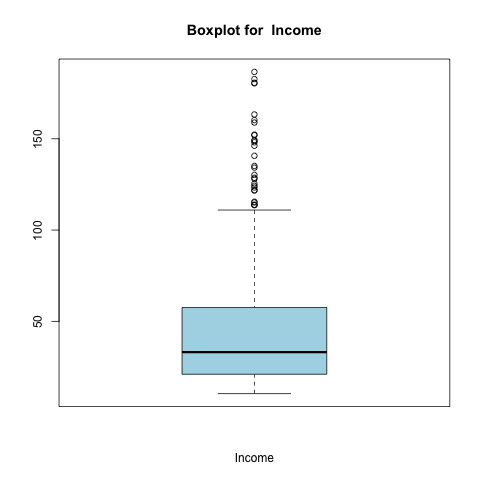
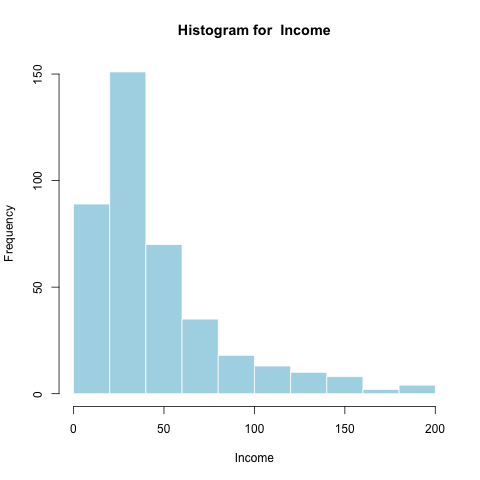

```{r setup, include=FALSE, echo=FALSE}
knitr::opts_chunk$set(echo = TRUE)
library(pander)
data <- read.csv("../data/datasets/Credit.csv", header=TRUE, row.names = 1)
```

## Introduction
- Credit.csv dataset
```{r, echo=FALSE}
panderOptions('table.split.table',60)
pander(head(data, 2))
```

- Want to predict Balance given ten predictors

# Methods

## Summaries of Variables

- Quantitative  
    - Summary table of max, min, range, median, 1st and 3rd quartiles, IQR, mean, and sd  
    - Histograms  
    - Boxplots
  
- Qualitative
    - Frequency and Relative Frequency Tables
    - Barplots of Frequencies
    - Conditional Boxplots between Balance and the qualitative variable
  
## Example: Income
<div class="columns-2">
  
  
  
</div>

## Example: Student (yes or no)

<div class="columns-2">
  
  
  
</div>

## Preparing the Data

- Dummy out the categorical variables

```
new_data <- model.matrix(Balance ~ ., data=data)
new_data <- cbind(new_data[ ,-1], Balance = data$Balance)
```

- Mean-center and standardize all variables

```
scaled_data <- scale(new_data, center = TRUE, scale = TRUE)
```

- Divide scaled data into training and test sets

# Regression Models

## Ordinary Least Squares
- Use `lm()` function
- Then find the coefficients and mse of the model

```
ols = lm(Balance~Income+Limit+Rating+Cards+Age+Education+GenderFemale
+StudentYes+MarriedYes+EthnicityAsian+EthnicityCaucasian, data=scaled_data)

ols_coeff = ols$coefficients[-1]

ols_mse = mean(ols$residuals^2)
```

## Ridge

- Use `glmnet` R package
- First perform cross validation on the training set to find the value of lambda that results in the lowest cross validation error

```
grid <- grid <- 10^(seq(10, -2, length = 100))

cv <- cv.glmnet(trainX, trainY, intercept = FALSE, standardize = FALSE, lambda = grid,
alpha=0)

lambda = cv$lambda.min
```

## Ridge: Continued

- Find mean squared error of the best model with this value of lambda on the test set

```
predictedY <- predict(cv, newx = testX, s = "lambda.min")
ssq <- sum((predictedY - testY)^2)
mse = ssq/nrow(testX)
```

- Using that value of lambda, refit the model on the whole dataset to find the official coefficients

```
fcv <- glmnet(dataX, dataY, intercept = FALSE, standardize = FALSE, lambda = lambda,
alpha=0)
coeff <- coef(fcv)
```

## Lasso

- Similar to Ridge, first perform cross validation to find best value of lambda

```
cv_out = cv.glmnet(train_x, train_y, alpha=1, intercept=FALSE, standardize=FALSE,
lambda=grid)
lasso_lambda = cv_out$lambda.min
```

- Find the mse, then refit the model to find the official coefficients

```
lasso_pred = predict(lasso_mod, s = lasso_lambda, newx=test_x)
lasso_mse = mean((lasso_pred-test_y)^2)
lasso_out = glmnet(scaled_x, scaled_y, alpha=1, lambda=grid)
lasso_coeff = predict(lasso_out,type="coefficients",s=lasso_lambda)[2:12,]
```

## Principal Components

- Use `pls` R package
- Peform 10-fold cross-validation on the training set 
- Find the number of components which yields the lowest mse
- Apply the model to the whole dataset with the number of components, and find the official coefficients

```
pcr_model <- pcr(Balance ~ ., data=training, validation = "CV")
test_mses <- c(rep(0, 12))
for (i in 1:12) {
  pcr_pred <- predict(pcr_model, test, ncomp = i)
  test_mses[i] = mean((pcr_pred - testY)^2)
}
which.min(test_mses)
full_pcr_model <- pcr(Balance ~ ., data=data)
best_coefs <- full_pcr_model$coefficients[, , 12][-1]
```

## Partial Least Squares

- Similar to Principal Components, use `pls` package
- Perform 10-fold cross validation to find the best number of components
- Fit the model with this number of components to the whole dataset and find the coefficients

```
pls_fit = plsr(Balance ~ ., data=training_data,scale=TRUE, validation="CV")
pls_comp = which.min(pls_fit$validation$PRESS)

pls_pred = predict(pls_fit, test_x, ncomp=pls_comp)
pls_mse = mean((pls_pred-test_y)^2)

pls_out = plsr(Balance ~ ., data=scaled_data ,scale=TRUE,ncomp=pls_comp)
pls_coeff = pls_out$coefficients[, , pls_comp]
```

# Comparison of All Models

## Plot of Coefficients


## Table of MSEs

```{r echo=FALSE}
load("../data/results.Rdata")
panderOptions('round', 5)
pander(mse_table, caption="MSE for Different Models")

```

- We can see that ols and pls have the lowest mean squared errors, and would therefore be the best models for predicting Balance

# Thanks!

